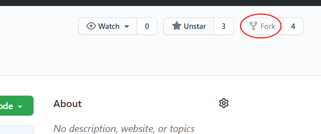
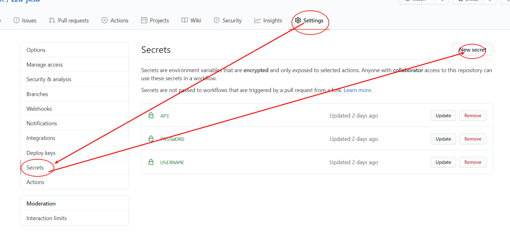
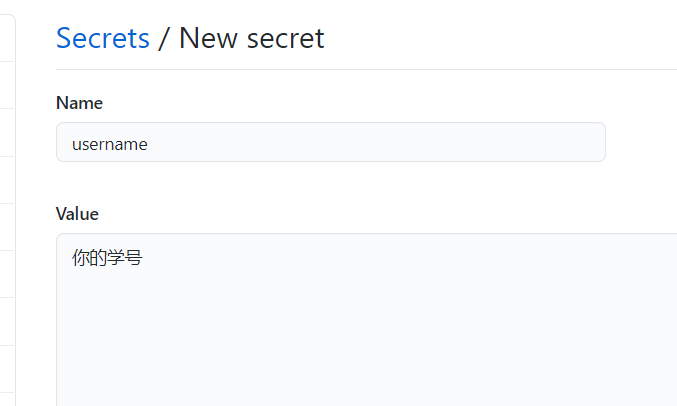
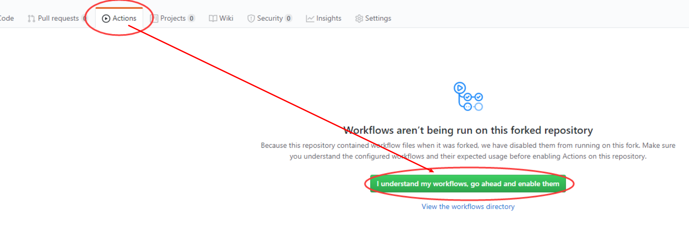

# zzu-jksb

使用 GitHub Actions 每日全自动完成郑州大学健康情况上报，一次部署长期**全自动**执行

**你的学号和密码仅保存在你的GitHub账户下，不会向他人任何人展示**

**签到过程中涉及到的脚本文件均在目录下开源**

教程地址：https://wcac.art/posts/jksb/

## 使用说明

### 一、

Fork 本仓库

### 二、

点击你的仓库右上角的 Settings，找到 Secrets 这一项，添加三个Secrets环境变量，前者在 Name 中填写，后者在 Value 中填写，冒号不需要填写

* username ：你的学号

* password ：你的密码

* api ：(微信推送打卡成功提示需要)  你的server酱api密钥(登录http://sc.ftqq.com/ 并绑定微信可获取) 如果不需要微信推送请用000000代替

### 三、

点击Action，再点击I understand my workflows, go ahead and enable them

### 四、

在你的仓库内随便改点什么 (比如点本文右上角的编辑并在最后增加一段话(不能是空格)) 提交一下就可以手动触发一次 Github Actions 

**做完这步后请在页面上方的Actions标签里确认已成功执行**

以后每天的00:15和04:15都会自动完成打卡 (该时间可修改pythonpackage.yml文件进行配置)

在 Actions 处可以看到打卡情况，假如发生错误会看到详情。

### 其他、

**有问题请开Issue**
